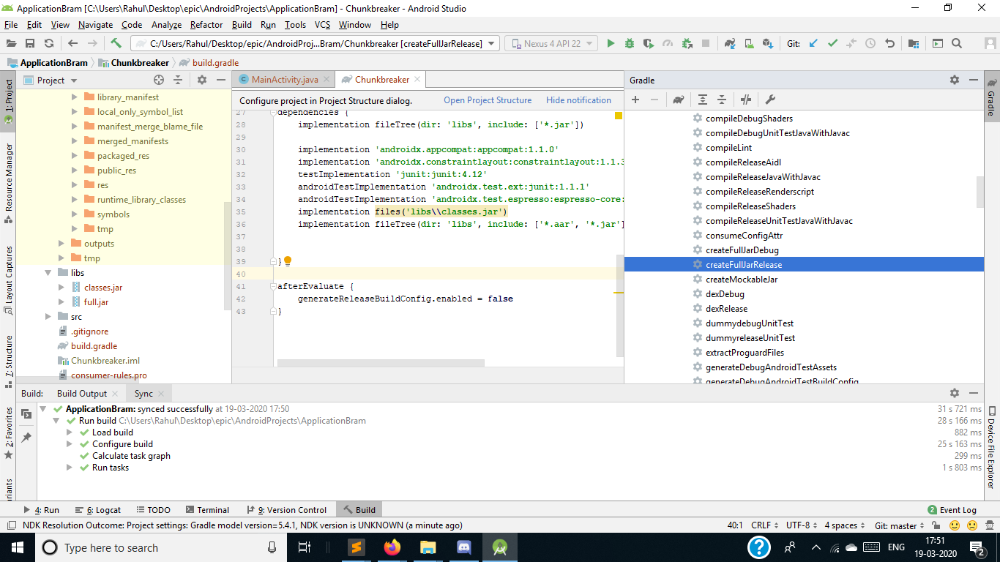

# Bramble Unity Module Package

Download and import the package into your Unity Project.

Sample Scenes of Authorize App Button and Wallet Scenes are in the Bramble folder.

The Plugins folder contains the Bramble JAR Plugin which is required for the Oauth Functionality to work.

Placeholder Email: rahul.soshte47@gmail.com
Password: 123456

# How to create Bramble Oauth JAR plugin
1. Open Android Studio. Create a Empty Project.

2. Create New Empty Project


3. Create New Module. Select Android Library. Ensure package name is com.dan.chunkbreaker and Library Name as Chunkbreaker


4. Now copy this file 
```
C:\Program Files\Unity\Hub\Editor\2018.4.18f1\Editor\Data\PlaybackEngines\AndroidPlayer\Variations\mono\Release\Classes\classes.jar
```
into Android Studio 
```
Chunkbreaker/libs/
```

5. Open Files -> Project Structure -> Dependencies. Click on Chunkbreaker. Add JAR Dependency libs/classes.jar

6. Your Chunkbreaker/build.gradle file will look something like this 
```
apply plugin: 'com.android.library'

android {
    compileSdkVersion 28
    buildToolsVersion "29.0.3"


    defaultConfig {
        minSdkVersion 15
        targetSdkVersion 28
        versionCode 1
        versionName "1.0"

        testInstrumentationRunner "androidx.test.runner.AndroidJUnitRunner"
        consumerProguardFiles 'consumer-rules.pro'
    }

    buildTypes {
        release {
            minifyEnabled false
            proguardFiles getDefaultProguardFile('proguard-android-optimize.txt'), 'proguard-rules.pro'
        }
    }

}

dependencies {
    implementation fileTree(dir: 'libs', include: ['*.jar'])

    implementation 'androidx.appcompat:appcompat:1.1.0'
    implementation 'androidx.constraintlayout:constraintlayout:1.1.3'
    testImplementation 'junit:junit:4.12'
    androidTestImplementation 'androidx.test.ext:junit:1.1.1'
    androidTestImplementation 'androidx.test.espresso:espresso-core:3.2.0'
    implementation files('libs\\classes.jar')
    implementation fileTree(dir: 'libs', include: ['*.aar', '*.jar'], exclude: [])


}

afterEvaluate {
    generateReleaseBuildConfig.enabled = false
}
```

Just ensure to add this line is present at the end of gradle file
```
afterEvaluate {
    generateReleaseBuildConfig.enabled = false
}
```


7. After that click on Gradle at the right hand side of Android Studio.

Then click on Chunkbreaker -> createFullJarRelease
Then copy the Chunkbreaker/build/full_jar/release/createFullJarRelease/full.jar in Unity's Android/Plugins/